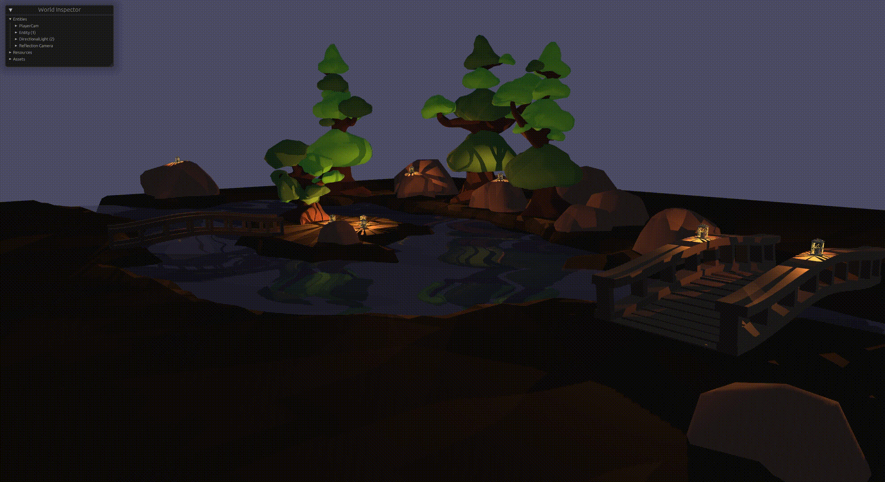

# Birdylook
This is a project mainly to showcase more advanced techniques in the [bevy](https://bevyengine.org/) ecosystem.
If you see any bugs or want to rewrite something more efficiently or readable feel free to make a PR or open an Issue to describe your thoughts.
Currently, the project aims to implement a nice-looking environment with:
- Animated water
- Good looking lighting
- Animated grass

## Animated Water
### Waves
Currently, the water uses vertex displacement to animate waves.
Stacking sin waves are used as periodic functions as you can see in [the shader code](assets/shaders/water_shader.wgsl). This is great for calmer-looking water but if you need more stormy water in your game I may recommend using the approach described in the [gpugems book](https://developer.nvidia.com/gpugems/gpugems/part-i-natural-effects/chapter-1-effective-water-simulation-physical-models) (see Equation 8a, 8b).

### Reflections
For the reflection planar reflections are used. 
This is implemented using a reflection camera rendering to a texture used in the shader.
The technique is described in [this video](https://www.youtube.com/watch?v=GADTasvDOX4&list=PLRIWtICgwaX23jiqVByUs0bqhnalNTNZh&index=4).
The reflection is later [distorted using the normals of the vertex](assets/shaders/water_shader.wgsl)(improvements for the distortions are very welcomed)

### Current limitations
Objects underwater are captured by the reflecting camera resulting in sometimes questionable results.
The solution would be to wait for clipping plane support or use the frustum of the camera to only capture objects above the water.

## Lighting
The lanterns do emit light by having a simple point light as child. 
Furthermore, plans are to move/distort the light by the wind.

## Animated grass
todo

# License
## Code
This project is free, open source and permissively licensed! All code in this repository is dual-licensed under either:

MIT License (LICENSE-MIT or http://opensource.org/licenses/MIT)
Apache License, Version 2.0 (LICENSE-APACHE or http://www.apache.org/licenses/LICENSE-2.0)
at your option. This means you can select the license you prefer! This dual-licensing approach is the de-facto standard in the Rust ecosystem and there are very good reasons to include both.

## Assets
All assets found in the [assets](assets/) folder are under the [CC0 1.0 Universal](https://creativecommons.org/publicdomain/zero/1.0/) license. 
Meaning you're free to use the assets freely in any project, personal or commercial. There's no need to ask permission before using these. Giving attribution is not required, but is greatly appreciated! 